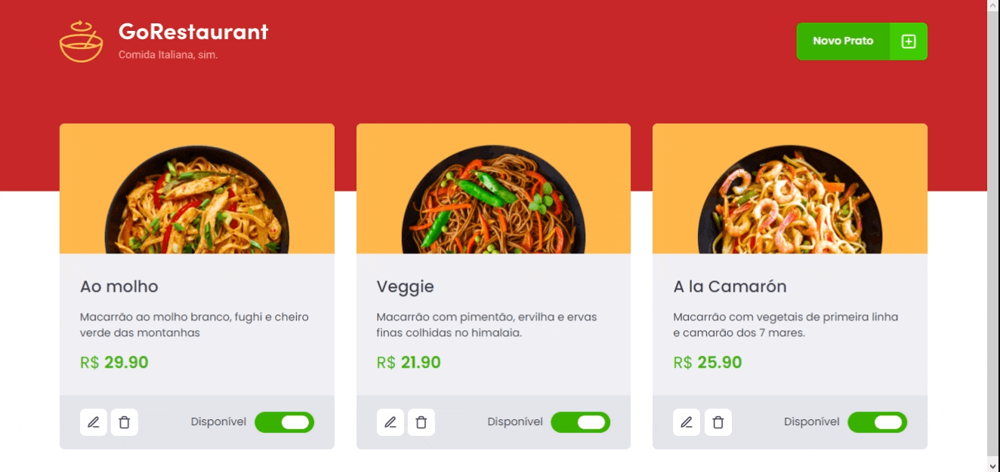

<p align="center">
   
</p>

<p align="center">
   <a href="https://www.linkedin.com/in/filipefmotta/">
      
   </a>

  <a aria-label="Last Commit" href="https://github.com/filipefdm/desafio04-trilha-reactjs/commits/master">
    
  </a>
</p>



# Temas

- [O que é o GoRestaurant?](#o-que-é-o-coffee-delivery)
- [Objetivos do desafio](#objetivos-do-desafio)
- [Tecnologias](#tecnologias)
- [Como executar?](#como-executar)

## O que é o GoRestaurant?

<b>GoRestaurant</b> é o quarto desafio do Ignite da Trilha de ReactJS criado pela [Rocketseat](https://rocketseat.com.br).
É uma loja de pizzaria online onde é possível editar as informações da pizza, excluir e também adicionar novos pratos.

## Objetivos do desafio

Nesse desafio, o objetivo era realizar dois processos de migração:

- Javascript para Typescript;
- Class Components para Function Components.

## Tecnologias

Foram utilizadas as seguintes tecnologias e ferramentas:

- [React](https://pt-br.reactjs.org)
- [Axios](https://axios-http.com/ptbr/docs/intro)
- [React Modal](https://www.npmjs.com/package/react-modal)
- [Styled Components](https://styled-components.com)
- [TypeScript](https://www.typescriptlang.org/)
- [Yup](https://www.npmjs.com/package/yup)

## Como executar?

```bash
# Clone o repositório:
git clone https://github.com/filipefdm/desafio04-trilha-reactjs.git
# Acesse a pasta do projeto:
cd desafio04-trilha-reactjs
# Instalando as dependências do projeto:
yarn
# Rodando a Fake API:
yarn server
# Rodando a aplicação:
yarn start
```

Acesse <http://localhost:3000> no navegador para ver o resultado!

---

Feito com 💜 por [Filipe Motta](https://github.com/filipefdm) 😊
